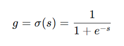
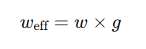
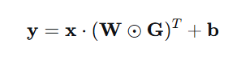
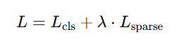
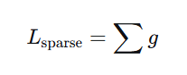
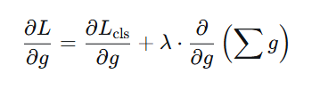
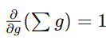
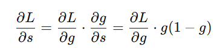
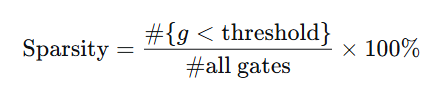

# **The Self-Pruning Neural Network**
## Setup

```bash
git clone <repo>
cd <repo>
python setup.py   # creates venv, installs deps
python main.py
```
Note: main.py was renamed from self-pruning-nn.py. Full commit history can be viewed in repository history.
## About the Project

This project implements a **self-pruning neural network** using PyTorch. The goal is to build a model that can **automatically learn which connections (weights) are important and remove the unnecessary ones during training**, instead of pruning after training.

---

### What problem are we solving?

Neural networks usually have **millions of parameters**, many of which are redundant. This leads to:
- Higher memory usage  
- Slower inference  
- Inefficient models  

In this project, we make the network **learn sparsity during training**, so that it becomes:
- Smaller  
- Faster  
- More efficient  

---

### How does the model work?

Each weight in the network is paired with a **learnable gate**:

- Gate = sigmoid(gate_score)  
- Effective weight = weight × gate  

This means:
- If gate ≈ 1 → the connection is kept  
- If gate ≈ 0 → the connection is effectively removed  

During training:
- The model learns both **weights** and **gate values**
- A sparsity penalty encourages many gates to become small

---

### Dataset Used

The model is trained on the **CIFAR-10 dataset**, which contains:

- **50,000 training images**
- **10,000 test images**
- Image size: **32 × 32 × 3 (RGB)**
- **10 classes** (airplane, car, bird, cat, etc.)

---

### Training Details

- Images are processed in **batches of 128**
- Total batches per epoch ≈ **50,000 / 128 ≈ 391 batches**
- The model is trained for **multiple epochs (e.g., 30 epochs)**

For each epoch:
- The model sees all 50,000 images once
- So over 30 epochs:
  - The model processes **50,000 × 30 = 1.5 million training samples**

---

### Model Architecture

A simple feed-forward neural network is used:

- Input: 3072 features (flattened image)
- Hidden Layer 1: 512 neurons  
- Hidden Layer 2: 256 neurons  
- Output Layer: 10 classes  

All layers use the custom **PrunableLinear** module.

---

### Loss Function

The model optimizes a combined loss:

Total Loss = Classification Loss + λ × Sparsity Loss

- **Classification Loss**: measures prediction accuracy  
- **Sparsity Loss**: sum of all gate values  

The sparsity term pushes unnecessary connections toward zero.

---

### What does the model learn?

During training, the model learns:
- Which connections are important (gates stay high)
- Which connections are not useful (gates go near zero)

This results in:
- A large number of weights being effectively removed  
- Only the most important connections being retained  

---

### Final Outcome

After training:
- A significant percentage of weights are pruned  
- The model still maintains good accuracy  
- The gate distribution shows:
  - A spike near 0 (pruned connections)
  - A cluster near higher values (important connections)

---

### Why is this important?

This approach demonstrates how neural networks can:
- Become efficient **without manual pruning**
- Learn structure **automatically**
- Balance **accuracy vs model size**

This is a key idea in modern AI for:
- model compression  
- efficient deployment  
- edge devices  

## Methodology (with Key Formulas)

This model introduces a learnable gating mechanism that allows the network to decide which connections to keep and which to suppress during training – all within the standard optimisation loop.

---

### 1. Gate Computation

For each weight, we define a learnable **gate score** \(s\). The actual gate value \(g\) is obtained via the sigmoid function:



- \(g ∈ (0,1)\) – smooth and differentiable
- \(g ≈ 1\) → connection is kept active  
- \(g ≈ 0\) → connection is effectively pruned

---

### 2. Effective Weight

Instead of using the raw weight \(w\), the forward pass uses a **gated weight**:



Thus, when \(g ≈ 1\) the original weight matters; when \(g ≈ 0\) the connection contributes almost nothing.

---

### 3. Layer Output

For an input vector x, the output of a prunable linear layer is:



where  
W = weight matrix,  
G = gate matrix (same shape),  
⊙ = element‑wise multiplication,  
b = bias.

---

### 4. Loss Function

The total loss combines classification performance with a sparsity penalty:



- **Classification loss** (CrossEntropy): L 
cls
​
- **Sparsity loss** (L1 penalty on gates):  



This acts like an **L1 regularisation on the gates**, encouraging many of them to become small.

---

### 5. Optimisation (Gradient Flow)

The model is trained using the **Adam** optimizer, which updates all parameters (weights, biases, gate scores) by minimising the total loss \(L\).

The gradient of the total loss with respect to a gate value \(g\) is:



Since 

, 

the sparsity term **consistently pushes every gate downward**.  
In contrast, the classification loss pushes gates **up or down** depending on whether the connection helps accuracy.

> **Trade‑off**  
> - Classification loss → keeps useful gates high  
> - Sparsity loss → drives all gates towards zero  

As a result, during training:
- **Important connections** retain gate values near \(1\).
- **Unimportant connections** have their gates shrunk toward \(0\).

The gradient with respect to the **gate score** \(s\) is obtained via the chain rule:



which allows end‑to‑end learning of the pruning behaviour.

---

### 6. Sparsity Measurement

After training, sparsity is measured as:



Here we use a strict threshold, threshold = 0.01 (i.e., g < 1 x 10^-2).

---

### Summary

The model learns to:
- retain important connections (\(g ≈ 1\))
- suppress unimportant ones (\(g ≈ 0\))

This results in a **sparse and efficient neural network** that prunes itself during training – no separate pruning step required.

---

## Results Summary

| Lambda (λ) | Test Accuracy (%) | Sparsity (<0.01) (%) |
|------------|------------------|----------------------|
| 1e-6       | 52.50            | 68.53                |
| 5e-6       | 52.31            | 77.39                |
| 1e-5       | 53.86            | 76.01                |
| 1e-4       | 54.39            | 87.04                |
| 5e-4       | 51.65            | 95.90                |

---

## Best Model’s Gate Distribution

The model with **λ = 1e-6** was selected as the best because it exhibits the **clearest bimodal distribution** (large spike at 0, visible cluster near 1), confirming successful selective pruning.


**Interpretation**  
- Strong peak near 0 → effective suppression of unnecessary connections.  
- Distinct cluster near 1 → important connections are retained.  
- Smooth transition between the two – typical for sigmoid‑based gating.

With **68.53% sparsity** (gates < 0.01) and **52.50% test accuracy**, the network demonstrably learns to prune itself while maintaining reasonable performance.

---

