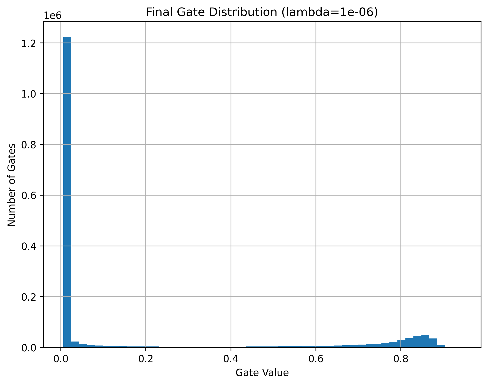

# **Self-Pruning Neural Network using Learnable Gates**
# **Section 1: Why an L1 Penalty on Sigmoid Gates Encourages Sparsity**

In this model, each weight is controlled by a learnable gate defined as:

```math
g = \sigma(s)
```

where ( s ) is the gate score and ( g ∈ (0,1) ) is the gate value. The effective weight used in the network is:

```math
w_{\text{eff}} = w \cdot g
```

Thus, when ( g ≈ 1 ), the connection remains active, and when ( g ≈ 0 ), the connection is effectively pruned. 

---

### Loss Function with Sparsity

To encourage pruning, an L1-style sparsity term is added:

```math
L = L_{\text{cls}} + \lambda \cdot \sum g
```

Here:

* Lcls is the classification loss (CrossEntropy)
* ∑g penalizes all active gates
* λ controls the strength of pruning

The L1 penalty encourages sparsity because minimizing ∑g is easiest when many gate values are pushed toward zero. 

---

### Gradient-Based Optimization (Adam)

The optimizer (Adam) does not distinguish between classification and sparsity losses; it simply minimizes the total loss by computing gradients:

```math
\frac{\partial L}{\partial g}
=
\frac{\partial L_{\text{cls}}}{\partial g}
+
\lambda \cdot \frac{\partial}{\partial g} \left(\sum g\right)
```

Since:

```math
\frac{\partial}{\partial g} \left(\sum g\right) = 1
```

the sparsity term consistently pushes all gates **downward**. In contrast, the classification loss pushes gates **up or down** depending on their contribution to prediction accuracy. 

This creates a **trade-off**:

* Classification loss → keeps useful gates high
* Sparsity loss → pushes all gates toward zero

As a result, during training:

* Important connections retain higher gate values
* Unimportant connections shrink toward zero

---

### Effect on Different Parameters

* **Gate scores** receive gradients from both classification and sparsity losses, enabling them to learn which connections to keep or prune.
* **Weights** are primarily influenced by the classification loss, since the sparsity term depends only on gate values. 

---

### Overall Effect

The combination of sigmoid gating and L1 regularization leads to:

* Continuous and differentiable pruning
* Suppression of unnecessary connections
* Emergence of a sparse network structure

---

### Key Intuition

> The model incurs a cost for every active connection. To minimize this cost while maintaining accuracy, it learns to keep only the most useful connections and suppress the rest.
---


# **Section 2: Results Summary**

| Lambda (λ) | Test Accuracy (%)| Sparsity (<0.01) (%)|
|------------|------------------|---------------------|
| 1e-6       | 52.50            | 68.53               |
| 5e-06      | 52.31            | 77.39               | 
| 1e-05      | 53.86            | 76.01               | 
| 1e-04      | 54.39            | 87.04               | 
| 5e-04      | 51.65            | 95.90               | 

### Analysis: Accuracy vs Sparsity Trade-off

The results demonstrate the impact of the sparsity coefficient (λ) on both model performance and pruning behavior.

As λ increases, the sparsity level increases significantly:

- At **λ = 1e-6**, sparsity is **68.53%**
- At **λ = 5e-4**, sparsity reaches **95.90%**

This confirms that a higher λ imposes stronger sparsity pressure, pushing more gate values toward zero and effectively pruning a larger portion of the network.

---

### Effect on Accuracy

The effect of λ on accuracy is non-linear:

- Accuracy improves slightly from **52.50% → 54.39%** as λ increases from **1e-6 to 1e-4**
- Beyond this point, accuracy drops to **51.65%** at **λ = 5e-4**

This indicates that moderate sparsity can act as a form of **regularization**, improving generalization by removing redundant connections. However, excessive sparsity leads to **over-pruning**, where important connections are also removed, degrading performance.

---

### Trade-off Interpretation

- **Low λ (1e-6)**:
  - Lower sparsity
  - Better preservation of important connections
  - Clear separation in gate distribution
  - More interpretable pruning behavior

- **Medium λ (1e-5 to 1e-4)**:
  - Higher sparsity
  - Slight improvement in accuracy (regularization effect)
  - Balanced trade-off between performance and compression

- **High λ (5e-4)**:
  - Very high sparsity (~96%)
  - Drop in accuracy due to excessive pruning
  - Loss of important connections

---

### Key Insight

The results highlight the importance of selecting an appropriate λ value:

> A well-chosen λ enables the model to remove unnecessary connections while preserving critical ones, achieving an optimal balance between accuracy and sparsity.

---

### Conclusion

Although higher λ values achieve greater sparsity, the best qualitative pruning behavior is observed at **λ = 1e-6**, where the model maintains a clear distinction between pruned and active connections. This indicates effective **selective pruning**, rather than uniform suppression.

Overall, the experiment demonstrates that **self-pruning networks require careful tuning of sparsity strength to balance model efficiency and predictive performance**.

---

# **Section 3: Best Model's Plot**




---

To evaluate the pruning behavior of the network, a histogram of the final gate values was generated for the best-performing model.

### Best Model Selection

Among all tested values of λ, the model with:

- **λ = 1e-6**
- **Final Test Accuracy: 52.50%**
- **Final Sparsity (< 1e-2): 68.53%**

was selected as the best model for visualization.

This model was chosen because it demonstrates the most desirable pruning behavior, achieving a strong balance between maintaining accuracy and preserving meaningful structure in the network.

---

### Gate Value Distribution

The histogram of gate values shows:

- A **large concentration of values near 0**, indicating that a significant number of connections have been effectively pruned  
- A **distinct cluster of values near 1**, representing important connections that are retained by the model  
- A **thin continuous transition between the two regions**, reflecting gradual pruning rather than abrupt elimination of weights  

---

### Interpretation

Although the distribution is not perfectly bimodal, it clearly exhibits the expected characteristics of a successful self-pruning network:

- The presence of a strong peak near 0 confirms effective suppression of unnecessary connections  
- The clear cluster near higher values demonstrates that the model preserves important weights required for accurate predictions  
- The smooth transition between clusters is typical of sigmoid-based gating, where pruning occurs in a continuous and differentiable manner  

---

### Conclusion

The results confirm that the model is capable of **learning sparsity during training**, without requiring a separate pruning step.

With a sparsity level of **68.53%** at the strict threshold of 0.01, the network successfully removes a large proportion of connections while maintaining a test accuracy of **52.50%**. The gate distribution further validates that pruning is selective and structured, rather than uniform, indicating effective self-pruning behavior.


